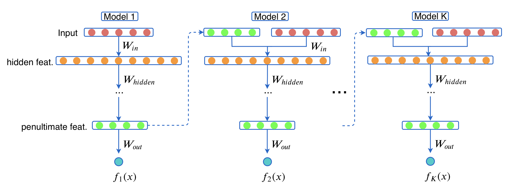

# GrowNet

Original PyTorch implementation of "Gradient Boosting Neural Networks: GrowNet" 

Paper at: https://arxiv.org/pdf/2002.07971.pdf

<p align="center">
  
</p>
<p align="justify">

## Getting Started

In this paper, we combine the power of gradient boosting with the flexibility and
versatility of neural networks and introduce a new modelling paradigm called GrowNet that can
build up a DNN layer by layer. Instead of decision trees, we use shallow neural networks as our
weak learners in a general gradient boosting framework that can be applied to a wide variety of tasks
spanning classification, regression and ranking. We introduce further innovations like adding second
order statistics to the training process, and also including a global corrective step that has been shown,
both in theory and in empirical evaluation, to provide performance lift and precise fine-tuning to the specific task at hand.


## Prerequisites

The code was implemented in Python 3.6.10 and utilized the packages (full list) in requirements.txt file. The platform I used was linux-64. Most important packages you need are the followings:
```
cudatoolkit=10.1.243 
numpy=1.18.1 
pandas=1.0.0 
python=3.6.10 
pytorch=1.4.0 
```

## Installing

To run the code, You may create a conda environment (assuming you already have miniconda3 installed) by the following command on terminal:

```
conda create --name grownet --file requirements.txt
```

## Data

You can download the datasets used in the paper from [Google Drive](https://drive.google.com/open?id=1NnBpwvfSdqs-lRb5UFIC-q8P455o3vO3).  Create a `data` folder under `GrowNet` and put the data under this folder.


#### 1. Classification:
The original HIGGS data is splitted into train and test (same as done in XGBoost paper) using higgs2libsvm.py script.

#### 2. Learning to Rank (L2R): 
Data Loading pipeline for L2R task is implemented by taking Microsoft (MSLR-WEB10K) dataset as a baseline. We also converted Yahoo into tis format (The jupyter notebook "yahoo2mslr" does this conversion). Thus if you want to use some other L2R datasets with GrowNet, please convert it into MSLR format. Below you can find a simple sample with just 10 features:
```
0 qid:10 1:2 2:0 3:0 4:0 5:2 6:0.666667 7:0 8:0 9:0 10:0.666667 
```
The first feature is label, second is query id and the rest are data features.

#### 3. Regression:
Training and test splits of regression datasets are done in jupyter notebook "reg_train_test_split". The data link already contains splitted data. 

## Experiments

To reproduce the results from pape, first activate conda virtual environment

```
conda activate grownet
```
Then simply navigate to the task folder: Classification, L2R or Regression and execute the following command on terminal:

```
./train.sh
```

You may change the dataset, number of hidden layers, number of hidden units in hidden layers, batch size, learning rate and etc from train.sh. 

The results may vary 1% or less between identical runs due to random initialization.

### Contact

Feel free to drop me an email if you have any questions: s.badirli@gmail.com

### Acknowledgments

* To his immense credit, my colleague, Xuanqing Liu (https://xuanqing94.github.io/), did an awesome job on the code development.  
